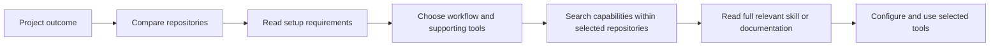

# AI Toolkit

**Find the right tool. Read the relevant skill. Keep the rest out of context.**

[](https://github.com/cjcsecurity/ai-toolkit/actions/workflows/ci.yml)
[](docs/wiki/Getting-Started.md)
[](docs/wiki/Tool-Catalog.md)
[](LICENSE)

A portable, reviewed library of **60 open-source tools and skill collections**, with local search over repository summaries, individual skills, and documentation. Built for agents and people who want useful capabilities without loading every skill into every conversation.

Compare systems first, then retrieve the precise instructions your task needs. Start with dependency-free lexical search; add local semantic search when you want meaning-based matches. Neither search mode needs a model API key.

[**Read the wiki →**](docs/wiki/Home.md) · [Browse all 60 tools](docs/wiki/Tool-Catalog.md) · [Understand retrieval](docs/wiki/Retrieval-System.md)

## Start small

Requires Git and Python 3.11+ on Linux, macOS, or WSL. Native Windows is not verified; use WSL. Run these commands from a terminal:

```bash
git clone https://github.com/cjcsecurity/ai-toolkit.git
cd ai-toolkit
python3 scripts/bootstrap.py --repo humanizer --lexical
bin/toolkit search "edit prose to sound natural" --kind repo --limit 8
bin/toolkit show humanizer
bin/toolkit skills humanizer "editing prose"
```

This downloads the pinned Humanizer source and builds a lexical index. The other entries remain searchable through their catalog summaries; their source files become available when you download them. To explore summaries without downloading any upstream source, run `python3 scripts/bootstrap.py` instead.

For all 60 source repositories and local semantic retrieval:

```bash
python3 scripts/bootstrap.py --all --semantic
bin/toolkit search-status
```

This explicitly downloads upstream sources, installs isolated search dependencies, downloads a pinned ONNX model, and builds the index. A cold full index can contain roughly 150,000 passages and take tens of minutes to hours depending on CPU, alongside substantial source and model disk usage. Start with selected sources if you only need a few tools. [uv](https://docs.astral.sh/uv/) is recommended for Python 3.12 provisioning; the semantic setup also supports an existing Python 3.11–3.13 environment. It does **not** install the 60 tools' application runtimes.

## How discovery works



```bash
# 1. Give each system a chance to appear in the comparison.
bin/toolkit search "browser automation and end-to-end tests" --kind repo --limit 8
bin/toolkit show playwright

# 2. Download the selected source, then retrieve a capability.
python3 scripts/bootstrap.py --repo playwright --lexical
bin/toolkit search "network mocking" --repo playwright
bin/toolkit docs playwright "installation"

# 3. Read a returned path, then record the project preference.
bin/toolkit read playwright README.md
bin/toolkit select playwright --project /path/to/project
```

Repository-first discovery keeps a large skill bundle from taking every comparison slot. Ranking supplies candidates; the agent or reader still checks fit, requirements, and alternatives. Project selection records preferences and does not install packages or activate services.

## What is inside

| Area | Examples | Explore |
| --- | --- | --- |
| Engineering and code intelligence | Serena, Codebase Memory, ast-grep, ECC | [Catalog](docs/wiki/Tool-Catalog.md#engineering-and-code-intelligence) |
| UI, design, and diagrams | Impeccable, Animate UI, Archify, Open Design | [Catalog](docs/wiki/Tool-Catalog.md#design-and-interfaces) |
| Browsers, research, and web data | Playwright, Scrapling, Firecrawl, Agent Reach | [Catalog](docs/wiki/Tool-Catalog.md#browsers-research-and-web-data) |
| Security and assessment | Semgrep, Strix, PentAGI, Skillspector | [Catalog](docs/wiki/Tool-Catalog.md#security-and-assessment) |
| AI infrastructure and retrieval | LiteLLM, Langfuse, Docling, OpenSandbox | [Catalog](docs/wiki/Tool-Catalog.md#ai-infrastructure-and-retrieval) |
| Finance and markets | Finance Skills, Financial Services, OpenAlice | [Catalog](docs/wiki/Tool-Catalog.md#finance-and-markets) |
| Writing, video, and audio | Humanizer, Hyperframes, Recordly, VoiceStudio | [Catalog](docs/wiki/Tool-Catalog.md#writing-video-and-audio) |

Every tool has a [wiki page](docs/wiki/Tool-Catalog.md) with its purpose, upstream revision, skill count, requirements, setup alternatives, and source entry points. The catalog covers several operating models: skills, CLIs, frameworks, reference collections, MCP servers, and full applications.

## Connect your agent

```bash
python3 scripts/install_agent.py --client both
export PATH="$HOME/.local/bin:$PATH"
```

Registration installs the selector and command launchers (`toolkit`, `toolkit-mcp`, `toolkit-serena`, and `toolkit-chrome-mcp`) for Codex and OpenCode. MCP adapters require separate runtime setup. It preserves existing user configuration and refuses conflicting destination files. Register either client separately with `--client codex` or `--client opencode`. See [agent integration](docs/wiki/Codex-and-OpenCode.md) for layout and scope.

The selector teaches the agent to compare systems, retrieve only relevant instructions, and reuse a project's selection. Specialized skills and MCP servers stay on demand. [Superpowers](https://github.com/obra/superpowers) is an optional complementary engineering workflow, installed separately; it is not one of the 60 catalog entries.

## Availability is explicit

- **Cataloged:** reviewed metadata and a source revision are recorded.
- **Source downloaded:** a pinned checkout is available for reading and indexing.
- **Runtime configured:** the tool's own dependencies, services, credentials, and verification have been handled on your machine.

Downloading a repository establishes only the second state. Read the tool's requirements before configuring it. Browser sessions, application credentials, paid APIs, and model providers are separate from local toolkit retrieval.

```bash
bin/toolkit --budget 30000 doctor
bin/toolkit search-status
```

The default output budget is **8,000 characters**, not tokens. Put `--budget` before the command and use `read --offset` to continue longer files.

[Runtime setup](docs/wiki/Runtime-Setup.md) · [Maintenance](docs/wiki/Maintenance.md) · [Troubleshooting](docs/wiki/Troubleshooting.md) · [Security and privacy](docs/wiki/Security-and-Privacy.md) · [Contributing](CONTRIBUTING.md)

The toolkit manager is MIT licensed. Upstream tools retain their own licenses, which are included in their downloaded repositories. A catalog entry is not an endorsement or a substitute for upstream documentation.
