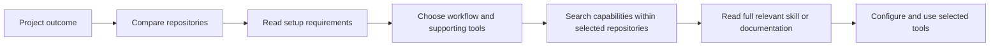

# AI Toolkit

**Find the right tool. Read the relevant skill. Keep the rest out of context.**

[](https://github.com/cjcsecurity/ai-toolkit/actions/workflows/ci.yml)
[](docs/wiki/Getting-Started.md)
[](docs/wiki/Tool-Catalog.md)
[](LICENSE)

A portable, reviewed library of **60 open-source tools and skill collections**, with local search over repository summaries, individual skills, and documentation. Built for agents and people who want useful capabilities without loading every skill into every conversation.

Compare systems first, then retrieve the precise instructions your task needs. Start with dependency-free lexical search; add local semantic search when you want meaning-based matches. Neither search mode needs a model API key.

## Contents

- [Start small](#start-small)
- [How discovery works](#how-discovery-works)
- [RAG for your agent](#rag-for-your-agent)
- [Tool catalog — all 60 tools](#tool-catalog)
- [Connect your agent](#connect-your-agent)
- [Availability is explicit](#availability-is-explicit)
- [Documentation and wiki](#documentation-and-wiki)

## Start small

Requires Git and Python 3.11+ on Linux, macOS, or WSL. Native Windows is not verified; use WSL. Run these commands from a terminal:

```bash
git clone https://github.com/cjcsecurity/ai-toolkit.git
cd ai-toolkit
python3 scripts/bootstrap.py --repo humanizer --lexical
bin/toolkit search "edit prose to sound natural" --kind repo --limit 8
bin/toolkit show humanizer
bin/toolkit skills humanizer "editing prose"
```

This downloads the pinned Humanizer source and builds a lexical index. The other entries remain searchable through their catalog summaries; their source files become available when you download them. To explore summaries without downloading any upstream source, run `python3 scripts/bootstrap.py` instead.

For all 60 source repositories and local semantic retrieval:

```bash
python3 scripts/bootstrap.py --all --semantic
bin/toolkit search-status
```

This explicitly downloads upstream sources, installs isolated search dependencies, downloads a pinned ONNX model, and builds the index. A cold full index can contain roughly 150,000 passages and take tens of minutes to hours depending on CPU, alongside substantial source and model disk usage. Start with selected sources if you only need a few tools. [uv](https://docs.astral.sh/uv/) is recommended for Python 3.12 provisioning; the semantic setup also supports an existing Python 3.11–3.13 environment. It does **not** install the 60 tools' application runtimes.

## How discovery works



```bash
# 1. Give each system a chance to appear in the comparison.
bin/toolkit search "browser automation and end-to-end tests" --kind repo --limit 8
bin/toolkit show playwright

# 2. Download the selected source, then retrieve a capability.
python3 scripts/bootstrap.py --repo playwright --lexical
bin/toolkit search "network mocking" --repo playwright
bin/toolkit docs playwright "installation"

# 3. Read a returned path, then record the project preference.
bin/toolkit read playwright README.md
bin/toolkit select playwright --project /path/to/project
```

Repository-first discovery keeps a large skill bundle from taking every comparison slot. Ranking supplies candidates; the agent or reader still checks fit, requirements, and alternatives. Project selection records preferences and does not install packages or activate services.

## RAG for your agent

Ask for a project recommendation with source evidence:

```bash
bin/toolkit --budget 16000 recommend \
  "End-to-end browser tests for my TypeScript application" \
  --constraints "Headless CI; inspect installation requirements"
```

Local keyword and vector search retrieve repository summaries and internal skills/docs. The RAG service combines them into a diverse evidence bundle with source paths, line ranges, commit verification, prerequisites and explicit fallback status. Your agent generates the recommendation from that evidence. Constraints are context for the agent to assess, not automatic compatibility filters.

Shell-capable agents use the CLI; MCP-compatible hosts can use the optional stdio server's five tools. See the [RAG guide](docs/rag.md) for architecture, setup, host configuration and evaluation, and the [agent demonstration](docs/rag-demo.md) for a sourced answer from a real MCP session.

## Tool catalog

All **60 tools and collections** are listed below, grouped by their main use. Each tool name links to its detailed wiki page with requirements, setup instructions, and pinned upstream sources. The skill counts refer to cataloged paths, not globally installed skills.

### Engineering and code intelligence

| Tool | Type | Skills | Purpose |
| --- | --- | ---: | --- |
| [agent-skills](docs/wiki/tools/agent-skills.md) | skill-bundle | 25 | Twenty-five engineering skills and lifecycle commands covering requirements, implementation, testing, review, UI, APIs, performance and shipping. |
| [ast-grep](docs/wiki/tools/ast-grep.md) | cli | 0 | Tree-sitter based structural code search, YAML lint rules and AST-aware rewrites, with Rust CLI and Node.js/Python programmatic bindings. |
| [codebase-memory-mcp](docs/wiki/tools/codebase-memory-mcp.md) | mcp | 0 | Native local code knowledge-graph indexer with structural/semantic search, call tracing, architecture and change-impact queries through MCP or one-shot CLI. |
| [context7](docs/wiki/tools/context7.md) | cli | 9 | Context7 CLI, MCP server, SDKs and agent skills retrieve version-specific library documentation and code snippets from the hosted Context7 index. |
| [ecc](docs/wiki/tools/ecc.md) | skill-bundle | 293 | Cross-agent engineering collection with 293 canonical skills for language and framework patterns, reviews, LLM pipelines, evaluation and agent memory; optional ECC CLI, hooks, rules and client adapters have a separate integration footprint. |
| [gh-aw](docs/wiki/tools/gh-aw.md) | cli | 5 | GitHub CLI extension for defining AI repository automation in Markdown and compiling it to GitHub Actions with scoped permissions and validated safe outputs. |
| [loop-engineering](docs/wiki/tools/loop-engineering.md) | reference | 40 | Patterns, templates, skills and a Node CLI for recurring repository triage, PR maintenance and verification loops. |
| [matt-pocock-skills](docs/wiki/tools/matt-pocock-skills.md) | skill-bundle | 31 | Engineering and productivity skills for domain glossaries, architecture decisions, requirements interviews, specifications, ticket planning, TDD, debugging, reviews, teaching and writing agent instructions. |
| [open-code-review](docs/wiki/tools/open-code-review.md) | cli | 2 | Go-based code review CLI combining deterministic Git diff selection, file grouping and review rules with model-backed line-level findings, full-file scans and host-agent delegation without a separate OCR LLM endpoint. |
| [ponytail](docs/wiki/tools/ponytail.md) | skill-bundle | 6 | Coding simplification skills for reuse-first implementation, over-engineering review, repository audits and deferred-shortcut tracking, with optional multi-agent-host plugins, lifecycle hooks and an MCP instruction server. |
| [serena](docs/wiki/tools/serena.md) | mcp | 0 | MCP coding toolkit with language-server-backed symbol lookup, reference navigation, semantic editing, refactoring and project memories. |

### Design and interfaces

| Tool | Type | Skills | Purpose |
| --- | --- | ---: | --- |
| [animate-ui](docs/wiki/tools/animate-ui.md) | reference | 0 | React/TypeScript/Tailwind/Motion animated component source and shadcn-compatible registry, with documentation and optional shadcn Registry MCP setup. |
| [archify](docs/wiki/tools/archify.md) | skill-bundle | 1 | Diagram-authoring skill and Node.js renderer producing validated standalone interactive HTML/SVG for architecture, workflows, sequences, data flow and lifecycles from typed JSON, with repository evidence and image/video exports. |
| [awesome-claude-design](docs/wiki/tools/awesome-claude-design.md) | reference | 0 | Curated reference directory linking brand design-system DESIGN.md documents and prototypes for use in design prompts. |
| [huashu-design](docs/wiki/tools/huashu-design.md) | skill-bundle | 1 | Chinese-language design skill for HTML prototypes, slide decks, animation, data visualization, critique, and local PDF/PPTX/video export, with bundled templates and scripts. |
| [impeccable](docs/wiki/tools/impeccable.md) | skill-bundle | 20 | One frontend design router skill with 24 commands, detailed UX and visual design references, optional live browser workflows, and a deterministic design detector engine. |
| [open-design](docs/wiki/tools/open-design.md) | application | 338 | Local design studio and daemon for prototypes, decks, images, videos, design systems, plugin catalogs, and integration with coding-agent CLIs; includes a stdio MCP interface. |
| [taste-skill](docs/wiki/tools/taste-skill.md) | skill-bundle | 13 | Portable frontend design and redesign guidance, including experimental v2 taste, minimalist, brutalist, image-to-code, and image-generation reference workflows. |

### Browsers, research, and web data

| Tool | Type | Skills | Purpose |
| --- | --- | ---: | --- |
| [agent-reach](docs/wiki/tools/agent-reach.md) | cli | 1 | CLI and skill that select, configure, and check upstream tools for web pages, video transcripts, RSS, GitHub, search, and social-platform research. |
| [autocli](docs/wiki/tools/autocli.md) | cli | 0 | Rust CLI offering declarative website adapters, authenticated browser-session reuse, public API retrieval and external CLI passthrough. |
| [browser-harness](docs/wiki/tools/browser-harness.md) | cli | 1 | CLI, agent skill, and optional stdio MCP server for controlling a real Chrome browser over CDP, with reusable local helper functions. |
| [chrome-devtools-mcp](docs/wiki/tools/chrome-devtools-mcp.md) | mcp | 7 | Chrome automation and debugging MCP server plus CLI for DOM/browser interaction, screenshots, network/console inspection and performance traces. |
| [cloakbrowser](docs/wiki/tools/cloakbrowser.md) | cli | 0 | Python/JavaScript wrappers and CLI around a separately downloaded patched Chromium browser, compatible with Playwright/Puppeteer workflows and persistent profiles. |
| [crucix](docs/wiki/tools/crucix.md) | application | 0 | Local OSINT dashboard and data-collection application aggregating geopolitical, economic, environmental, transport, and market sources, with optional LLM analysis and messaging bots. |
| [firecrawl](docs/wiki/tools/firecrawl.md) | application | 5 | Web-data API and SDKs for search, URL scraping, crawling, mapping, browser interactions, and structured extraction; includes self-hosted server source and agent skills. |
| [opencli](docs/wiki/tools/opencli.md) | cli | 6 | TypeScript CLI with website/Electron adapters and browser primitives using a Chrome extension and local bridge daemon. |
| [playwright](docs/wiki/tools/playwright.md) | framework | 3 | Browser automation and end-to-end tests across Chromium, Firefox and WebKit, with locators, web-first assertions, screenshots, network mocking, tracing and production CLI/trace/component-testing skills. |
| [public-apis](docs/wiki/tools/public-apis.md) | reference | 0 | Curated catalog of public APIs organized by topic, with descriptions and authentication, HTTPS, and CORS information. |
| [scrapling](docs/wiki/tools/scrapling.md) | cli | 1 | Python HTML parser, HTTP/browser fetchers, adaptive selectors, spider framework, scraping CLI, and optional MCP server. |

### Security and assessment

| Tool | Type | Skills | Purpose |
| --- | --- | ---: | --- |
| [agentic-bug-hunter](docs/wiki/tools/agentic-bug-hunter.md) | cli | 16 | Bug-bounty CLI, skill collection, and agent integrations for reconnaissance, vulnerability investigation, finding validation, and report generation. |
| [anthropic-cybersecurity-skills](docs/wiki/tools/anthropic-cybersecurity-skills.md) | skill-bundle | 818 | Independent community collection of 818 structured skills spanning defensive security, incident response, forensics, cloud security, and authorized offensive testing. |
| [cyberstrike](docs/wiki/tools/cyberstrike.md) | application | 7,689 | AI security-assessment harness with terminal/web interfaces, specialized agents, a large on-demand skill collection including CIS/NIST/MITRE controls, integrated browser testing, and optional remote/MCP tools. |
| [hackingtool](docs/wiki/tools/hackingtool.md) | cli | 0 | Python security-tool catalog, installer and launcher with category/tag search, optional AI recommendations and guided workflows; includes a documented catalog of 215 active tools across 21 categories. |
| [hexstrike-ai](docs/wiki/tools/hexstrike-ai.md) | mcp | 0 | Python API service and MCP bridge that expose external reconnaissance, web-security, binary-analysis, forensics, and cloud-security tools to AI clients. |
| [pentagi](docs/wiki/tools/pentagi.md) | application | 0 | Containerized autonomous penetration-testing application with agent workflows, security tools, browser/search integrations, persistent memory, reports, and a web UI. |
| [security-audit-skill](docs/wiki/tools/security-audit-skill.md) | skill-bundle | 1 | Source-first security audit guidance with trust-boundary analysis, coverage-led hunting, independent finding verification, structured verdicts and machine-readable audit reports. |
| [semgrep](docs/wiki/tools/semgrep.md) | cli | 0 | Local multi-language static analysis with code-like rules, bug/security searches, custom YAML rules and CI scanning; optional bundled MCP server integrates findings with coding agents. |
| [shannon](docs/wiki/tools/shannon.md) | application | 0 | Autonomous security-testing application that analyzes source-available web applications/APIs and attempts exploit validation in containerized worker sessions. |
| [skillspector](docs/wiki/tools/skillspector.md) | cli | 1 | Static and optional LLM-based scanner for agent skill bundles, with vulnerability-pattern analysis, dependency checks and JSON/SARIF reports. |
| [strix](docs/wiki/tools/strix.md) | application | 9 | AI application-security assessment CLI and agent skills for source, web and API testing, remediation and CI workflows, with Docker sandboxes, model-provider configuration and separate managed-cloud integrations. |

### AI infrastructure and retrieval

| Tool | Type | Skills | Purpose |
| --- | --- | ---: | --- |
| [agentmemory](docs/wiki/tools/agentmemory.md) | application | 17 | Persistent agent memory service using the iii engine, BM25/optional embeddings, knowledge graphs, MCP/REST APIs, native skills and agent lifecycle integrations. |
| [arcbox](docs/wiki/tools/arcbox.md) | application | 0 | Rust container and virtual-machine runtime for macOS with Docker compatibility, Kubernetes, Linux/macOS guests and disposable agent sandboxes. |
| [docling](docs/wiki/tools/docling.md) | framework | 1 | Local document conversion and extraction for PDF, Office files, HTML, images and audio into Markdown or structured DoclingDocument JSON, with OCR, tables and RAG chunking. |
| [langfuse](docs/wiki/tools/langfuse.md) | application | 0 | Self-hosted LLM observability, tracing, prompt management, evaluation datasets and experiments platform. |
| [laya](docs/wiki/tools/laya.md) | mcp | 0 | Local non-autoregressive decision model SDK and CLI for typed choices, scores, triage, routing, and moderation, with optional HTTP and stdio MCP servers. |
| [litellm](docs/wiki/tools/litellm.md) | framework | 0 | Unified OpenAI-compatible Python SDK and self-hosted AI gateway for multiple LLM providers with routing, budgets, virtual keys, guardrails and spend tracking. |
| [opensandbox](docs/wiki/tools/opensandbox.md) | framework | 1 | Self-hosted isolated execution environments for AI agents, code, files, browsers and desktops with Docker/Kubernetes runtimes, SDKs, CLI and MCP. |
| [promptfoo](docs/wiki/tools/promptfoo.md) | cli | 4 | CLI/library for LLM prompt and agent evaluations, model comparisons, assertions, CI gates, authorized red teaming and optional MCP evaluation tools; includes four production setup/run skills. |
| [rag-anything](docs/wiki/tools/rag-anything.md) | application | 0 | Python framework built on LightRAG for parsing and indexing documents, images, tables, equations, audio, and video for multimodal retrieval and question answering. |
| [ruflo](docs/wiki/tools/ruflo.md) | application | 373 | Agent orchestration meta-harness with CLI/MCP, agent teams, workflow plugins, memory, hooks and background coordination. |

### Finance and markets

| Tool | Type | Skills | Purpose |
| --- | --- | ---: | --- |
| [finance-skills](docs/wiki/tools/finance-skills.md) | skill-bundle | 26 | Agent Skills for market data, company valuation, earnings, options, stock research, read-only social research, startup analysis, and optional external market-data providers. |
| [financial-services](docs/wiki/tools/financial-services.md) | skill-bundle | 112 | Claude financial-services plugin marketplace containing financial modeling, banking, equity research, private-equity, fund-admin, operations, and advisor workflows plus data connectors. |
| [openalice](docs/wiki/tools/openalice.md) | application | 15 | Local trading-research orchestrator with agent workspaces, market tools, recurring research, inbox, quantitative projects, and optional broker integration. |

### Writing, video, and audio

| Tool | Type | Skills | Purpose |
| --- | --- | ---: | --- |
| [brag](docs/wiki/tools/brag.md) | skill-bundle | 2 | Agent skills that turn a project or website into a short launch video with motion, music and share copy; classic Brag uses Hyperframes and the slim variant uses available local rendering tools. |
| [humanizer](docs/wiki/tools/humanizer.md) | skill-bundle | 1 | Prose editing skill that removes common AI writing patterns, matches an author voice, and preserves facts, citations and non-prose file content. |
| [hyperframes](docs/wiki/tools/hyperframes.md) | cli | 40 | HTML/CSS/media video framework with seekable animations, deterministic MP4 rendering, a preview CLI, reusable blocks, and task-specific agent skills. |
| [hypit](docs/wiki/tools/hypit.md) | application | 1 | Agent-oriented video creation system with SVML compositions, captions, reusable assets, local rendering and optional generation/model services. |
| [pixelle-video](docs/wiki/tools/pixelle-video.md) | application | 0 | Python/Streamlit short-video creation platform combining LLM scripts, image/video workflows, speech, templates, background music, and FFmpeg composition. |
| [recordly](docs/wiki/tools/recordly.md) | application | 0 | Electron desktop screen recorder and editor with automatic zooms, cursor effects, webcam overlays, timeline editing, and video/GIF export. |
| [voicestudio](docs/wiki/tools/voicestudio.md) | application | 2 | Local speech studio with Electron desktop, voice cloning and design, transcription, dubbing, audiobooks, a REST API and an optional MCP connection to its running backend. |

## Connect your agent

```bash
python3 scripts/install_agent.py --client both
export PATH="$HOME/.local/bin:$PATH"
```

Registration installs the selector and command launchers (`toolkit`, `toolkit-mcp`, `toolkit-serena`, and `toolkit-chrome-mcp`) for Codex and OpenCode. MCP adapters require separate runtime setup. It preserves existing user configuration and refuses conflicting destination files. Register either client separately with `--client codex` or `--client opencode`. See [agent integration](docs/wiki/Codex-and-OpenCode.md) for layout and scope.

The selector teaches the agent to compare systems, retrieve only relevant instructions, and reuse a project's selection. Specialized skills and MCP servers stay on demand. [Superpowers](https://github.com/obra/superpowers) is an optional complementary engineering workflow, installed separately; it is not one of the 60 catalog entries.

## Availability is explicit

- **Cataloged:** reviewed metadata and a source revision are recorded.
- **Source downloaded:** a pinned checkout is available for reading and indexing.
- **Runtime configured:** the tool's own dependencies, services, credentials, and verification have been handled on your machine.

Downloading a repository establishes only the second state. Read the tool's requirements before configuring it. Browser sessions, application credentials, paid APIs, and model providers are separate from local toolkit retrieval.

```bash
bin/toolkit --budget 30000 doctor
bin/toolkit search-status
```

The default output budget is **8,000 characters**, not tokens. Put `--budget` before the command and use `read --offset` to continue longer files.

## Documentation and wiki

| Guide | What you will find |
| --- | --- |
| [Wiki home](docs/wiki/Home.md) | Overview and how the documentation fits together |
| [Getting started](docs/wiki/Getting-Started.md) | Small lexical install, full semantic install, and first searches |
| [RAG and agent recommendations](docs/rag.md) | Cited evidence, MCP access, evaluation and limitations |
| [Retrieval system](docs/wiki/Retrieval-System.md) | Corpus, local embeddings, keyword search, scoring, and limits |
| [Codex and OpenCode](docs/wiki/Codex-and-OpenCode.md) | Client registration, global instructions, and on-demand skills |
| [Runtime setup](docs/wiki/Runtime-Setup.md) | Application dependencies and optional MCP adapters |
| [Maintenance](docs/wiki/Maintenance.md) | Source pins, updates, documentation generation, and indexing |
| [Troubleshooting](docs/wiki/Troubleshooting.md) | Missing source, lexical fallback, registration conflicts, and runtime gaps |
| [Security and privacy](docs/wiki/Security-and-Privacy.md) | Network boundaries, credentials, browser isolation, and provenance |
| [Contributing](CONTRIBUTING.md) | Adding tools and updating reviewed catalog metadata |

The toolkit manager is MIT licensed. Upstream tools retain their own licenses, which are included in their downloaded repositories. A catalog entry is not an endorsement or a substitute for upstream documentation.
