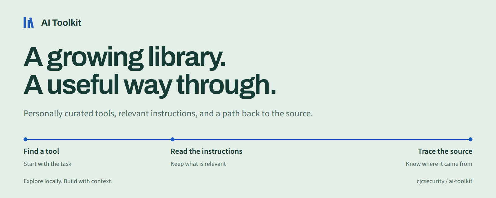
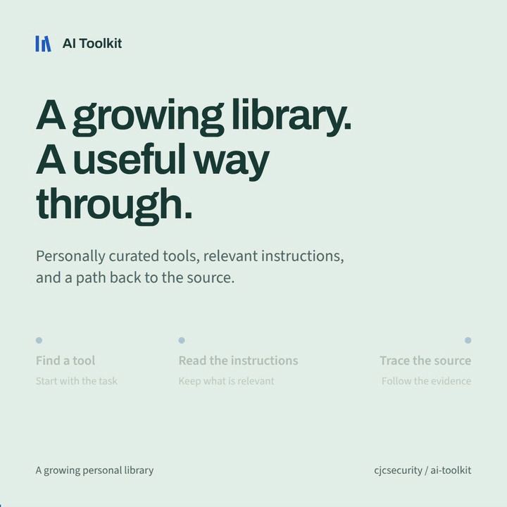
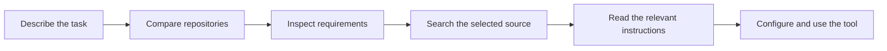
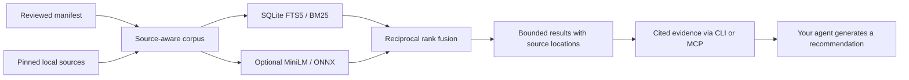

# AI Toolkit



[](docs/wiki/Getting-Started.md)
[](LICENSE)

**A growing personal tool library with a local RAG backend for coding agents.**

I keep AI Toolkit as a curated collection of open-source tools and agent skills I've reviewed. Some are part of my working setup; others are tools I want to explore. The catalog records their purpose, requirements, setup guidance, and source revision, so a useful find does not disappear into a bookmark folder.

The Python CLI searches repository summaries, individual skills, and documentation from local source copies. Compare candidates, check what they need to run, and retrieve the instructions that fit the task. The collection grows as I find and review useful tools; inclusion does not mean every tool is installed or used daily.

Search runs locally: start with Python's standard library and SQLite, then add semantic retrieval when you need matches by meaning. Neither retrieval mode needs a model API key. The CLI and optional MCP server support **retrieval-augmented generation (RAG)** by assembling cited source evidence for your connected agent to use when generating a recommendation. Use it with Claude Code, Codex, OpenCode, Gemini CLI, Cursor, Copilot, and Windsurf.

[Quick start](#quick-start) · [See it in action](#see-it-in-action) · [Local RAG](#local-rag-for-coding-agents) · [Engineering](#engineering) · [Browse the library](#tool-catalog) · [Wiki](docs/wiki/Home.md) · [Contributing](CONTRIBUTING.md)

## See it in action

This project's launch demo was made with tools found through the library: **Brag** for the story and **Hyperframes** for animation and rendering. Humanizer helped edit the copy; Semgrep scanned the Python manager.

[](docs/assets/ai-toolkit-demo.mp4)

[Watch or download the 22-second video](docs/assets/ai-toolkit-demo.mp4) · [Static preview](docs/assets/poster.jpg) · [How it was made](docs/demo.md)

The animation is a styled replay of actual CLI output, abridged for readability. The toolkit finds the workflow; the agent reads and uses the selected tools.

## Quick start

Requires **Git and Python 3.11+** on Linux, macOS, or WSL. Native Windows is not verified; use WSL.

```bash
git clone https://github.com/cjcsecurity/ai-toolkit.git
cd ai-toolkit
python3 scripts/bootstrap.py
bin/toolkit search "launch video" --kind repo --limit 3 --lexical
```

This indexes the catalog summaries using the standard library. It downloads no upstream repositories or model files. An abridged result from the example:

```json
{
  "id": "brag",
  "repo": "latent-spaces/brag",
  "match_kind": "repo",
  "retrieval": "lexical"
}
```

Inspect a candidate, download its pinned source, then retrieve its instructions:

```bash
bin/toolkit show brag
python3 scripts/bootstrap.py --repo brag --lexical
bin/toolkit skills brag "launch video" --limit 2 --lexical
bin/toolkit --budget 12000 read brag skills/brag/SKILL.md
```

`show` explains requirements and setup. Bootstrap downloads source; a tool's application runtime is a separate setup step. The CLI reports whether each source exists on your machine.

<details>
<summary><strong>Add local semantic search</strong></summary>

Start with the sources you need:

```bash
python3 scripts/bootstrap.py --repo brag --repo hyperframes --semantic
bin/toolkit search "make a short film about my project" --kind repo
bin/toolkit search-status
```

Semantic setup installs isolated dependencies, downloads a pinned ONNX model, and builds local embeddings. [uv](https://docs.astral.sh/uv/) is recommended for Python 3.12 provisioning; an existing Python 3.12–3.13 environment also works.

For the entire library, use `python3 scripts/bootstrap.py --all --semantic`. A cold full index can contain roughly 150,000 passages and take tens of minutes to hours depending on CPU, with substantial source and model disk usage. It does not install the cataloged application runtimes. See [getting started](docs/wiki/Getting-Started.md) for setup options.

</details>

## How discovery works



Repository search gives each system a comparison candidate, so a large skill collection cannot occupy every slot. After choosing a shortlist, search within it and read the complete relevant skill or guide.

```bash
bin/toolkit search "browser automation" --kind repo --limit 8
bin/toolkit show playwright
python3 scripts/bootstrap.py --repo playwright --lexical
bin/toolkit docs playwright "network mocking" --lexical
bin/toolkit select playwright --project /path/to/project
```

`select` records a project's preferences in `.ai-toolkit.json`; it does not install dependencies or start services. Rankings help with discovery. Inspect the requirements and source evidence before choosing a tool.

## Local RAG for coding agents

```bash
bin/toolkit --budget 16000 recommend \
  "Make a short launch video for my project" --limit 3 --lexical
```

`recommend` compares repository and capability matches, then returns a bounded evidence bundle with source IDs, paths, revision checks, and setup context. Your agent generates the recommendation from that evidence. Add `--project /path/to/project` to include saved tool preferences; explicit constraints remain context for the agent to assess.

The optional stdio MCP server exposes the same retrieval and evidence service to other hosts. [Set up RAG and MCP](docs/rag.md) for semantic recommendations, the source contract, and evaluation limits, or read the [recorded agent demonstration](docs/rag-demo.md).

## Engineering

The manager keeps discovery, source provisioning, and application setup separate. A catalog entry records reviewed metadata and an exact upstream commit. A downloaded checkout makes that source searchable. Runtime readiness depends on the selected tool's own dependencies and configuration.



| Decision | Why it matters | Implementation |
| --- | --- | --- |
| Standard-library lexical path | You can explore the catalog before installing a model runtime. | [toolkit.py](toolkit.py), [hybrid.py](hybrid.py) |
| Local embeddings with a content-hash cache | Semantic retrieval needs no query API; unchanged passages reuse their vectors. | [embeddings.py](embeddings.py), [hybrid.py](hybrid.py) |
| Paths, line ranges, and deduplicated capabilities | Matches are inspectable, and long manuals do not fill every result slot. | [corpus.py](corpus.py) |
| Atomic index replacement and validated source paths | Failed builds preserve the published index; reads stay within the selected source. | [toolkit.py](toolkit.py), [source sync](scripts/sync_sources.py) |
| Shared evidence service with source verification | Recommendations carry source IDs, revision checks, and explicit truncation; the calling agent supplies generation. | [RAG service](rag.py), [evidence contract](docs/rag.md) |
| Bounded output and on-demand MCP sessions | Agents retrieve selected context and load tool schemas when needed. | [MCP client](mcp_client.py), [selector skill](skills/toolkit-selector/SKILL.md) |

Only explicit setup downloads sources or models. Local retrieval does not make every catalog application offline; downstream services, credentials, and licenses belong to their respective tools. See [retrieval details](docs/wiki/Retrieval-System.md) and [security and privacy](docs/wiki/Security-and-Privacy.md).

## Connect your agent

```bash
python3 scripts/install_agent.py --client claude
export PATH="$HOME/.local/bin:$PATH"
```

Choose `--client claude`, `codex`, `opencode`, `gemini`, `cursor`, `copilot`, or `windsurf`. Registration installs the shared selector and launchers, preserves existing configuration, and refuses conflicting destinations. Add `--dry-run` to preview changes. The original `--client both` still selects Codex and OpenCode. MCP adapters require [separate runtime setup](docs/wiki/Runtime-Setup.md).

The selector teaches the agent to compare systems, retrieve relevant instructions, and reuse project choices. Specialized skills and MCP servers stay on demand. [Agent integration](docs/wiki/Agent-Integration.md) covers layout and scope. [Superpowers](https://github.com/obra/superpowers) is an optional complementary workflow, installed separately from the catalog.

Prefer native MCP tools? After [RAG setup](docs/rag.md), run `python3 scripts/mcp_config.py --client claude` to print the host configuration. Profiles also cover Cursor, Gemini CLI, VS Code, Copilot CLI, Windsurf, Cline, Roo Code, Continue, Codex, and OpenCode. See the [connection guide](docs/wiki/Agent-Integration.md#connect-the-rag-server) for destinations and verification.

## Tool catalog

Browse [the full catalog](catalog.md) or expand the inventory below. Each tool links to a guide with requirements, setup options, and pinned upstream sources. Skill counts refer to cataloged paths, not globally installed skills.

<details>
<summary><strong>Tools and collections, grouped by use</strong></summary>

### Engineering and code intelligence

| Tool | Type | Skills | Purpose |
| --- | --- | ---: | --- |
| [agent-skills](docs/wiki/tools/agent-skills.md) | skill-bundle | 25 | Twenty-five engineering skills and lifecycle commands covering requirements, implementation, testing, review, UI, APIs, performance and shipping. |
| [ast-grep](docs/wiki/tools/ast-grep.md) | cli | 0 | Tree-sitter based structural code search, YAML lint rules and AST-aware rewrites, with Rust CLI and Node.js/Python programmatic bindings. |
| [codebase-memory-mcp](docs/wiki/tools/codebase-memory-mcp.md) | mcp | 0 | Native local code knowledge-graph indexer with structural/semantic search, call tracing, architecture and change-impact queries through MCP or one-shot CLI. |
| [context7](docs/wiki/tools/context7.md) | cli | 9 | Context7 CLI, MCP server, SDKs and agent skills retrieve version-specific library documentation and code snippets from the hosted Context7 index. |
| [ecc](docs/wiki/tools/ecc.md) | skill-bundle | 293 | Cross-agent engineering collection with 293 canonical skills for language and framework patterns, reviews, LLM pipelines, evaluation and agent memory; optional ECC CLI, hooks, rules and client adapters have a separate integration footprint. |
| [gh-aw](docs/wiki/tools/gh-aw.md) | cli | 5 | GitHub CLI extension for defining AI repository automation in Markdown and compiling it to GitHub Actions with scoped permissions and validated safe outputs. |
| [loop-engineering](docs/wiki/tools/loop-engineering.md) | reference | 40 | Patterns, templates, skills and a Node CLI for recurring repository triage, PR maintenance and verification loops. |
| [matt-pocock-skills](docs/wiki/tools/matt-pocock-skills.md) | skill-bundle | 31 | Engineering and productivity skills for domain glossaries, architecture decisions, requirements interviews, specifications, ticket planning, TDD, debugging, reviews, teaching and writing agent instructions. |
| [open-code-review](docs/wiki/tools/open-code-review.md) | cli | 2 | Go-based code review CLI combining deterministic Git diff selection, file grouping and review rules with model-backed line-level findings, full-file scans and host-agent delegation without a separate OCR LLM endpoint. |
| [ponytail](docs/wiki/tools/ponytail.md) | skill-bundle | 6 | Coding simplification skills for reuse-first implementation, over-engineering review, repository audits and deferred-shortcut tracking, with optional multi-agent-host plugins, lifecycle hooks and an MCP instruction server. |
| [serena](docs/wiki/tools/serena.md) | mcp | 0 | MCP coding toolkit with language-server-backed symbol lookup, reference navigation, semantic editing, refactoring and project memories. |

### Design and interfaces

| Tool | Type | Skills | Purpose |
| --- | --- | ---: | --- |
| [animate-ui](docs/wiki/tools/animate-ui.md) | reference | 0 | React/TypeScript/Tailwind/Motion animated component source and shadcn-compatible registry, with documentation and optional shadcn Registry MCP setup. |
| [archify](docs/wiki/tools/archify.md) | skill-bundle | 1 | Diagram-authoring skill and Node.js renderer producing validated standalone interactive HTML/SVG for architecture, workflows, sequences, data flow and lifecycles from typed JSON, with repository evidence and image/video exports. |
| [awesome-claude-design](docs/wiki/tools/awesome-claude-design.md) | reference | 0 | Curated reference directory linking brand design-system DESIGN.md documents and prototypes for use in design prompts. |
| [huashu-design](docs/wiki/tools/huashu-design.md) | skill-bundle | 1 | Chinese-language design skill for HTML prototypes, slide decks, animation, data visualization, critique, and local PDF/PPTX/video export, with bundled templates and scripts. |
| [impeccable](docs/wiki/tools/impeccable.md) | skill-bundle | 20 | One frontend design router skill with 24 commands, detailed UX and visual design references, optional live browser workflows, and a deterministic design detector engine. |
| [open-design](docs/wiki/tools/open-design.md) | application | 338 | Local design studio and daemon for prototypes, decks, images, videos, design systems, plugin catalogs, and integration with coding-agent CLIs; includes a stdio MCP interface. |
| [taste-skill](docs/wiki/tools/taste-skill.md) | skill-bundle | 13 | Portable frontend design and redesign guidance, including experimental v2 taste, minimalist, brutalist, image-to-code, and image-generation reference workflows. |

### Browsers, research, and web data

| Tool | Type | Skills | Purpose |
| --- | --- | ---: | --- |
| [agent-reach](docs/wiki/tools/agent-reach.md) | cli | 1 | CLI and skill that select, configure, and check upstream tools for web pages, video transcripts, RSS, GitHub, search, and social-platform research. |
| [autocli](docs/wiki/tools/autocli.md) | cli | 0 | Rust CLI offering declarative website adapters, authenticated browser-session reuse, public API retrieval and external CLI passthrough. |
| [browser-harness](docs/wiki/tools/browser-harness.md) | cli | 1 | CLI, agent skill, and optional stdio MCP server for controlling a real Chrome browser over CDP, with reusable local helper functions. |
| [chrome-devtools-mcp](docs/wiki/tools/chrome-devtools-mcp.md) | mcp | 7 | Chrome automation and debugging MCP server plus CLI for DOM/browser interaction, screenshots, network/console inspection and performance traces. |
| [cloakbrowser](docs/wiki/tools/cloakbrowser.md) | cli | 0 | Python/JavaScript wrappers and CLI around a separately downloaded patched Chromium browser, compatible with Playwright/Puppeteer workflows and persistent profiles. |
| [crucix](docs/wiki/tools/crucix.md) | application | 0 | Local OSINT dashboard and data-collection application aggregating geopolitical, economic, environmental, transport, and market sources, with optional LLM analysis and messaging bots. |
| [firecrawl](docs/wiki/tools/firecrawl.md) | application | 5 | Web-data API and SDKs for search, URL scraping, crawling, mapping, browser interactions, and structured extraction; includes self-hosted server source and agent skills. |
| [opencli](docs/wiki/tools/opencli.md) | cli | 6 | TypeScript CLI with website/Electron adapters and browser primitives using a Chrome extension and local bridge daemon. |
| [playwright](docs/wiki/tools/playwright.md) | framework | 3 | Browser automation and end-to-end tests across Chromium, Firefox and WebKit, with locators, web-first assertions, screenshots, network mocking, tracing and production CLI/trace/component-testing skills. |
| [public-apis](docs/wiki/tools/public-apis.md) | reference | 0 | Curated catalog of public APIs organized by topic, with descriptions and authentication, HTTPS, and CORS information. |
| [scrapling](docs/wiki/tools/scrapling.md) | cli | 1 | Python HTML parser, HTTP/browser fetchers, adaptive selectors, spider framework, scraping CLI, and optional MCP server. |

### Security and assessment

| Tool | Type | Skills | Purpose |
| --- | --- | ---: | --- |
| [agentic-bug-hunter](docs/wiki/tools/agentic-bug-hunter.md) | cli | 16 | Bug-bounty CLI, skill collection, and agent integrations for reconnaissance, vulnerability investigation, finding validation, and report generation. |
| [anthropic-cybersecurity-skills](docs/wiki/tools/anthropic-cybersecurity-skills.md) | skill-bundle | 818 | Independent community collection of 818 structured skills spanning defensive security, incident response, forensics, cloud security, and authorized offensive testing. |
| [cyberstrike](docs/wiki/tools/cyberstrike.md) | application | 7,689 | AI security-assessment harness with terminal/web interfaces, specialized agents, a large on-demand skill collection including CIS/NIST/MITRE controls, integrated browser testing, and optional remote/MCP tools. |
| [hackingtool](docs/wiki/tools/hackingtool.md) | cli | 0 | Python security-tool catalog, installer and launcher with category/tag search, optional AI recommendations and guided workflows; includes a documented catalog of 215 active tools across 21 categories. |
| [hexstrike-ai](docs/wiki/tools/hexstrike-ai.md) | mcp | 0 | Python API service and MCP bridge that expose external reconnaissance, web-security, binary-analysis, forensics, and cloud-security tools to AI clients. |
| [pentagi](docs/wiki/tools/pentagi.md) | application | 0 | Containerized autonomous penetration-testing application with agent workflows, security tools, browser/search integrations, persistent memory, reports, and a web UI. |
| [security-audit-skill](docs/wiki/tools/security-audit-skill.md) | skill-bundle | 1 | Source-first security audit guidance with trust-boundary analysis, coverage-led hunting, independent finding verification, structured verdicts and machine-readable audit reports. |
| [semgrep](docs/wiki/tools/semgrep.md) | cli | 0 | Local multi-language static analysis with code-like rules, bug/security searches, custom YAML rules and CI scanning; optional bundled MCP server integrates findings with coding agents. |
| [shannon](docs/wiki/tools/shannon.md) | application | 0 | Autonomous security-testing application that analyzes source-available web applications/APIs and attempts exploit validation in containerized worker sessions. |
| [skillspector](docs/wiki/tools/skillspector.md) | cli | 1 | Static and optional LLM-based scanner for agent skill bundles, with vulnerability-pattern analysis, dependency checks and JSON/SARIF reports. |
| [strix](docs/wiki/tools/strix.md) | application | 9 | AI application-security assessment CLI and agent skills for source, web and API testing, remediation and CI workflows, with Docker sandboxes, model-provider configuration and separate managed-cloud integrations. |

### AI infrastructure and retrieval

| Tool | Type | Skills | Purpose |
| --- | --- | ---: | --- |
| [agentmemory](docs/wiki/tools/agentmemory.md) | application | 17 | Persistent agent memory service using the iii engine, BM25/optional embeddings, knowledge graphs, MCP/REST APIs, native skills and agent lifecycle integrations. |
| [arcbox](docs/wiki/tools/arcbox.md) | application | 0 | Rust container and virtual-machine runtime for macOS with Docker compatibility, Kubernetes, Linux/macOS guests and disposable agent sandboxes. |
| [docling](docs/wiki/tools/docling.md) | framework | 1 | Local document conversion and extraction for PDF, Office files, HTML, images and audio into Markdown or structured DoclingDocument JSON, with OCR, tables and RAG chunking. |
| [langfuse](docs/wiki/tools/langfuse.md) | application | 0 | Self-hosted LLM observability, tracing, prompt management, evaluation datasets and experiments platform. |
| [laya](docs/wiki/tools/laya.md) | mcp | 0 | Local non-autoregressive decision model SDK and CLI for typed choices, scores, triage, routing, and moderation, with optional HTTP and stdio MCP servers. |
| [litellm](docs/wiki/tools/litellm.md) | framework | 0 | Unified OpenAI-compatible Python SDK and self-hosted AI gateway for multiple LLM providers with routing, budgets, virtual keys, guardrails and spend tracking. |
| [opensandbox](docs/wiki/tools/opensandbox.md) | framework | 1 | Self-hosted isolated execution environments for AI agents, code, files, browsers and desktops with Docker/Kubernetes runtimes, SDKs, CLI and MCP. |
| [promptfoo](docs/wiki/tools/promptfoo.md) | cli | 4 | CLI/library for LLM prompt and agent evaluations, model comparisons, assertions, CI gates, authorized red teaming and optional MCP evaluation tools; includes four production setup/run skills. |
| [rag-anything](docs/wiki/tools/rag-anything.md) | application | 0 | Python framework built on LightRAG for parsing and indexing documents, images, tables, equations, audio, and video for multimodal retrieval and question answering. |
| [ruflo](docs/wiki/tools/ruflo.md) | application | 373 | Agent orchestration meta-harness with CLI/MCP, agent teams, workflow plugins, memory, hooks and background coordination. |

### Finance and markets

| Tool | Type | Skills | Purpose |
| --- | --- | ---: | --- |
| [finance-skills](docs/wiki/tools/finance-skills.md) | skill-bundle | 26 | Agent Skills for market data, company valuation, earnings, options, stock research, read-only social research, startup analysis, and optional external market-data providers. |
| [financial-services](docs/wiki/tools/financial-services.md) | skill-bundle | 112 | Claude financial-services plugin marketplace containing financial modeling, banking, equity research, private-equity, fund-admin, operations, and advisor workflows plus data connectors. |
| [openalice](docs/wiki/tools/openalice.md) | application | 15 | Local trading-research orchestrator with agent workspaces, market tools, recurring research, inbox, quantitative projects, and optional broker integration. |

### Writing, video, and audio

| Tool | Type | Skills | Purpose |
| --- | --- | ---: | --- |
| [brag](docs/wiki/tools/brag.md) | skill-bundle | 2 | Agent skills that turn a project or website into a short launch video with motion, music and share copy; classic Brag uses Hyperframes and the slim variant uses available local rendering tools. |
| [humanizer](docs/wiki/tools/humanizer.md) | skill-bundle | 1 | Prose editing skill that removes common AI writing patterns, matches an author voice, and preserves facts, citations and non-prose file content. |
| [hyperframes](docs/wiki/tools/hyperframes.md) | cli | 40 | HTML/CSS/media video framework with seekable animations, deterministic MP4 rendering, a preview CLI, reusable blocks, and task-specific agent skills. |
| [hypit](docs/wiki/tools/hypit.md) | application | 1 | Agent-oriented video creation system with SVML compositions, captions, reusable assets, local rendering and optional generation/model services. |
| [pixelle-video](docs/wiki/tools/pixelle-video.md) | application | 0 | Python/Streamlit short-video creation platform combining LLM scripts, image/video workflows, speech, templates, background music, and FFmpeg composition. |
| [recordly](docs/wiki/tools/recordly.md) | application | 0 | Electron desktop screen recorder and editor with automatic zooms, cursor effects, webcam overlays, timeline editing, and video/GIF export. |
| [voicestudio](docs/wiki/tools/voicestudio.md) | application | 2 | Local speech studio with Electron desktop, voice cloning and design, transcription, dubbing, audiobooks, a REST API and an optional MCP connection to its running backend. |

</details>

## Development and verification

```bash
python3 -m unittest discover -s tests -v
python3 scripts/generate_catalog_docs.py --check
```

CI exercises the standard-library path on Python 3.11, 3.12, and 3.13, plus a Python 3.12 job with optional vector and MCP dependencies. Tests cover source pinning, relocation, traversal protection, atomic rebuilds, retrieval, output budgets, and MCP lifecycle behavior. Optional real-model tests need the configured search runtime; skipped tests are reported explicitly.

These checks validate the manager, not every upstream application's runtime. See [security and privacy](docs/wiki/Security-and-Privacy.md) for the project's trust boundaries.

## Documentation

| Guide | What you will find |
| --- | --- |
| [Wiki home](docs/wiki/Home.md) | Project overview and documentation map |
| [Getting started](docs/wiki/Getting-Started.md) | Small lexical install, semantic setup, and first searches |
| [Retrieval system](docs/wiki/Retrieval-System.md) | Corpus, embeddings, keyword ranking, and context budgets |
| [Coding agents](docs/wiki/Agent-Integration.md) | Client registration and on-demand skills |
| [Runtime setup](docs/wiki/Runtime-Setup.md) | Application dependencies and MCP adapters |
| [Maintenance](docs/wiki/Maintenance.md) | Source pins, catalog generation, and indexing |
| [Troubleshooting](docs/wiki/Troubleshooting.md) | Missing sources, fallback, and configuration conflicts |
| [Security and privacy](docs/wiki/Security-and-Privacy.md) | Network boundaries, credentials, and provenance |
| [Contributing](CONTRIBUTING.md) | Adding tools and updating reviewed metadata |
| [Demo walkthrough](docs/demo.md) | A real discovery example and the tools used to create the video |

The toolkit manager is [MIT licensed](LICENSE). Upstream tools retain their own licenses. Catalog membership describes reviewed source and requirements; it is not a blanket endorsement or a substitute for upstream documentation.
