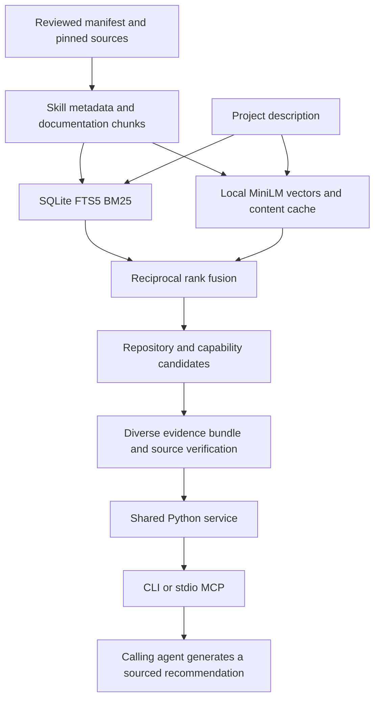

# Local tool-library RAG

AI Toolkit retrieves repositories and their internal capabilities, then supplies citable evidence to the calling agent. That agent generates the recommendation. Retrieval needs no LLM API key and does not start tools or install their dependencies.

The existing corpus and hybrid retriever supply the search foundation. This extension adds project evidence bundles, source verification, shared CLI/MCP access, and reproducible evaluation.

## Use it

```bash
bin/toolkit --budget 16000 recommend \
  "End-to-end browser tests for my TypeScript application" \
  --constraints "Headless CI; inspect installation requirements"

bin/toolkit --budget 16000 recommend \
  "Python HTML extraction that survives website layout changes" \
  --project /absolute/path/to/project

bin/toolkit search "adaptive selectors" --repo scrapling
bin/toolkit show scrapling
```

`--budget` and `--root` precede the subcommand. `--limit` caps candidates; budget packing can return fewer. `--lexical` requests keyword-only retrieval. `--project` reads only `.ai-toolkit.json` in the explicit directory, preserving preferences without scanning source code. Constraints accompany the evidence for the agent to assess; they are not automatic compatibility filters.

After optional agent registration, `toolkit` and `toolkit-rag-mcp` are available on PATH. Shell-capable agents can use `bin/toolkit` directly. MCP hosts launch the server with the settings below.

## Architecture



The pinned 384-dimensional MiniLM ONNX model, FastEmbed runtime, SQLite corpus and BM25/vector rank fusion are reused. Dense retrieval currently scores vectors with NumPy; there is no approximate nearest-neighbor database or external vector service.

Recommendations search repository summaries and internal capabilities separately, then combine their best ranks. Per-repository limits and skill-name deduplication apply before candidate truncation, preventing provider copies from monopolizing the pool. Up to two capability passages and one catalog source accompany each repository. Use scoped search to investigate further capabilities within a selected repository.

`rag.py` owns validation, model reuse, snapshot reads, recommendation assembly and output packing. `rag_sources.py` verifies attribution. `rag_server.py` uses the official MCP SDK 2.2.0 for protocol and schemas. A lock serializes service operations within each server process. Requests reopen the published index, and model files are revalidated when their file signatures change. Query inference remains local.

## Evidence contract

Responses include `schema_version: 1`, query, actual retrieval mode, index identity, results/candidates, sources, instructions and truncation. Index identity includes a corpus content fingerprint, manifest hash, schema and embedding-model fingerprint. Older indexes calculate and cache the corpus fingerprint until the published file changes; new builds store it in metadata.

Candidates reference `source_id` values in the same response. Sources contain repository identity, path, line span, indexed text, full-passage SHA256, and provenance. Catalog evidence projects the reviewed ID, repository, description and requirements with a JSON pointer; repository summaries do not invent file line numbers. Availability is computed from source presence on the current host and never establishes that an application runtime is installed.

| Provenance | Meaning |
| --- | --- |
| `verified` | Indexed text exists at the stated lines; current file text matches the recorded Git commit blob. |
| `catalog` | Evidence is the current manifest projection. |
| `modified` | Local content differs from the commit blob. |
| `revision-mismatch` | Local HEAD differs from the recorded revision. |
| `index-mismatch` | Indexed text is absent from the current line span. |
| `unversioned` | Commit-backed attribution could not be established. |
| `source-unavailable` | Current source could not be safely read. |

Only verified GitHub sources receive commit-pinned links. Other states preserve indexed evidence and expose the limitation. Attribution does not establish that source content is correct or safe to execute.

The budget counts compact JSON characters, excluding the newline and MCP protocol framing. Packing reduces optional passages, shortens evidence with `text_truncated`, marks shortened candidate metadata with `metadata_truncated`, and drops trailing candidates when necessary. References always resolve to retained sources. Increase the budget if needed; very small budgets can fit no candidate. SHA256 refers to the full indexed passage, even when returned text is shortened.

`read_tool_source` pages exact current text using character offsets and a whole-file hash. Continue until `next_offset: null`; restart if the hash changes between pages. `get_tool` pages catalog JSON text: concatenate pages before parsing. Read complete selected skills and setup guidance before acting.

Missing/stale indexes fail with an actionable error; RAG reads never rebuild them implicitly. Missing, incompatible or incomplete embeddings explicitly report `lexical-fallback`, including with empty results. `toolkit index --semantic` publishes a replacement. Existing search commands retain their previous index-maintenance behavior.

## Fresh checkout

Requires Git and Python 3.11+ for lexical retrieval; semantic retrieval supports Python 3.11–3.13, with 3.12 recommended. Linux, macOS and WSL use the portable launchers. Native Windows is not verified. Sources, model weights and indexes stay outside version control.

Start with selected pinned repositories and local embeddings:

```bash
python3 scripts/bootstrap.py --repo scrapling --repo playwright --repo docling --semantic
bin/toolkit --budget 16000 recommend "Python HTML extraction that survives layout changes"
```

Use `--all --semantic` for all 60 source repositories. Bootstrap preserves the relative catalog paths and downloads selected source only; application runtimes remain separate. Setup uses the network, while ordinary queries use the published local index. Rebuilds reuse unchanged embeddings. Selected-source setups have different coverage from the full-catalog evaluation.

For a dependency-free start, use `python3 scripts/bootstrap.py --lexical` and `bin/toolkit recommend "project description" --lexical`. Catalog-only recommendations can cite summaries; internal skill and documentation evidence requires downloaded sources and a rebuilt index.

The optional MCP server needs the SDK as well as the semantic environment:

```bash
uv pip install --python runtime/search/bin/python -r requirements-rag.txt
```

`uv` is recommended for environment provisioning. If the environment was created with Python's `venv` and includes pip, `runtime/search/bin/python -m pip install -r requirements-rag.txt` also works. The RAG lock includes the search pins plus MCP. Syncing only `requirements-search.txt` removes MCP from that environment.

For an alternate catalog, pass `--root /absolute/catalog` to the CLI, server, evaluator and `embeddings.py setup`, or set `AI_TOOLKIT_HOME` for the CLI/server. Source paths must stay inside that catalog root. Indexes, model files and embedding caches belong to that root; a Python environment can be reused across catalogs.

## Connect an MCP host

The server runs over local stdio with no HTTP listener. For hosts using the common `mcpServers` configuration shape:

```json
{
  "mcpServers": {
    "ai-toolkit": {
      "command": "/absolute/ai-toolkit/runtime/search/bin/python",
      "args": ["/absolute/ai-toolkit/rag_server.py", "--root", "/absolute/ai-toolkit"]
    }
  }
}
```

Host formats differ; use the same command/arguments in its stdio-server settings. The five tools are `search_tools`, `recommend_tools`, `get_tool`, `read_tool_source`, and `search_status`. Host configurations are not modified automatically. The existing `toolkit-mcp` command remains the client for other runtimes.

Test without configuring a host:

```bash
runtime/search/bin/python examples/rag_mcp.py --output /tmp/toolkit-evidence.json
```

This starts a real SDK session and saves evidence. See the [agent demonstration](rag-demo.md) for a separately generated recommendation and its evidence review. Protocol integration follows the [official MCP Python documentation](https://py.sdk.modelcontextprotocol.io/).

## Evaluate

```bash
runtime/search/bin/python -m unittest discover -s tests -v
runtime/search/bin/python evals/run.py --output /tmp/rag-evaluation.json
runtime/search/bin/python evals/run.py --task recommend --output /tmp/recommend-evaluation.json
```

The runner preserves 13 historical capability cases and adds six repository-selection cases and two unsupported-query observations. `development`/`holdout` identify when labels were introduced. One parser query overlaps between sets; these are not independent unseen-query generalization results.

The [evaluation report](../reviews/rag-evaluation.json) records dataset/implementation/index/model identities, its 64,000-character budget, actual fallback modes, ranks and latency. The larger evaluation budget isolates retrieval from the 8,000-character interactive budget. Hit@5 measures a designated source's presence; MRR@5 measures its first rank. Partial relevance labels do not support a recall claim. Timing includes source verification and packing; first-query timing includes lazy model initialization, and process startup is excluded.

Every miss and unsupported-query result remains in the report. Retrieval does not validate a generated answer. The caller must assess relevance, compare constraints, and cite support. Generated-answer faithfulness and installation success need separate evaluation.

## Limits

- Some broad requests and paraphrases still miss designated capabilities.
- Nonsense queries can return irrelevant results; there is no calibrated abstention detector.
- Constraints are agent context, not automatic compatibility rules.
- Dense retrieval scans stored vectors per query; larger or hosted workloads need capacity measurements.
- No reranker, remote hosting, code-symbol extraction or automatic source updates are included.
- Source presence is reported per host; application runtime readiness still requires explicit verification.
- One reviewed agent example demonstrates that example, not broad answer faithfulness.

## Recorded retrieval results

Measured on the full 60-repository, 149,904-passage catalog on 2026-10-04 UTC, using the report settings and limitations above.

| Mode | Label set/task | Hit@5 | MRR@5 |
| --- | --- | --- | --- |
| lexical | development/search | 8/13 | 0.5192 |
| lexical | holdout/recommend | 6/6 | 0.8333 |
| hybrid | development/search | 8/13 | 0.5641 |
| hybrid | holdout/recommend | 6/6 | 0.9167 |

The hybrid repository recommendations ranked five of six designated targets first. Both modes still missed five of thirteen historical capability targets. Unsupported queries can return results in either mode; all observations remain in the JSON report.
