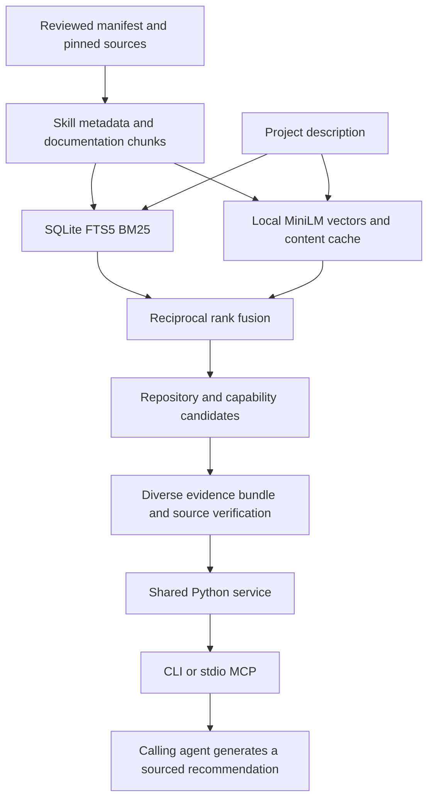

# Local tool-library RAG

AI Toolkit retrieves repositories and their internal capabilities, then supplies citable evidence to the calling agent. That agent generates the recommendation. Retrieval needs no LLM API key and does not start tools or install their dependencies.

The existing corpus and hybrid retriever supply the search foundation. This extension adds project evidence bundles, source verification, shared CLI/MCP access, and reproducible evaluation.

## Use it

```bash
bin/toolkit --budget 16000 recommend \
  "End-to-end browser tests for my TypeScript application" \
  --constraints "Headless CI; inspect installation requirements"

bin/toolkit --budget 16000 recommend \
  "Python HTML extraction that survives website layout changes" \
  --project /absolute/path/to/project

bin/toolkit search "adaptive selectors" --repo scrapling
bin/toolkit show scrapling
```

`--budget` and `--root` precede the subcommand. `--limit` caps candidates; budget packing can return fewer. `--lexical` requests keyword-only retrieval. `--project` reads only `.ai-toolkit.json` in the explicit directory, preserving preferences without scanning source code. Constraints accompany the evidence for the agent to assess; they are not automatic compatibility filters.

After [agent registration](wiki/Agent-Integration.md), shell-capable agents can use `toolkit` and MCP hosts can launch `toolkit-rag-mcp`. Registration does not install optional dependencies or change MCP host settings.

## Architecture



The pinned 384-dimensional MiniLM ONNX model, FastEmbed runtime, SQLite corpus and BM25/vector rank fusion are reused. Dense retrieval currently scores vectors with NumPy; there is no approximate nearest-neighbor database or external vector service.

Recommendations search repository summaries and internal capabilities separately, then combine their best ranks. Per-repository limits and skill-name deduplication apply before candidate truncation, preventing provider copies from monopolizing the pool. Up to two capability passages and one catalog source accompany each repository. Use scoped search to investigate further capabilities within a selected repository.

`rag.py` owns validation, model reuse, snapshot reads, recommendation assembly and output packing. `rag_sources.py` verifies attribution. `rag_server.py` uses the official MCP SDK 2.2.0 for protocol and schemas. A lock serializes service operations within each server process. Requests reopen the published index, and model files are revalidated when their file signatures change. Query inference remains local.

## Evidence contract

Responses include `schema_version: 1`, query, actual retrieval mode, index identity, results/candidates, sources, instructions and truncation. Index identity includes a corpus content fingerprint, manifest hash, schema and embedding-model fingerprint. Older indexes calculate and cache the corpus fingerprint until the published file changes; new builds store it in metadata.

Candidates reference `source_id` values in the same response. Sources contain repository identity, path, line span, indexed text, full-passage SHA256, and provenance. Catalog evidence is a JSON projection of reviewed manifest fields with a JSON pointer; repository summaries do not invent file line numbers.

| Provenance | Meaning |
| --- | --- |
| `verified` | Indexed text exists at the stated lines; current file text matches the recorded Git commit blob. |
| `catalog` | Evidence is the current manifest projection. |
| `modified` | Local content differs from the commit blob. |
| `revision-mismatch` | Local HEAD differs from the recorded revision. |
| `index-mismatch` | Indexed text is absent from the current line span. |
| `unversioned` | Commit-backed attribution could not be established. |
| `source-unavailable` | Current source could not be safely read. |

Only verified GitHub sources receive commit-pinned links. Other states preserve indexed evidence and expose the limitation. Attribution does not establish that source content is correct or safe to execute.

The budget counts compact JSON characters, excluding the newline and MCP protocol framing. Packing reduces optional passages, shortens evidence with `text_truncated`, marks shortened candidate metadata with `metadata_truncated`, and drops trailing candidates when necessary. References always resolve to retained sources. Increase the budget if needed; very small budgets can fit no candidate. SHA256 refers to the full indexed passage, even when returned text is shortened.

`read_tool_source` pages exact current text using character offsets and a whole-file hash. Continue until `next_offset: null`; restart if the hash changes between pages. `get_tool` pages catalog JSON text: concatenate pages before parsing. Read complete selected skills and setup guidance before acting.

Missing/stale indexes fail with an actionable error; RAG reads never rebuild them implicitly. Missing, incompatible or incomplete embeddings explicitly report `lexical-fallback`, including with empty results. `toolkit index --semantic` publishes a replacement. Existing search commands retain their previous index-maintenance behavior.

## Set up a checkout

Start with Git and Python 3.11+ for lexical retrieval:

```bash
python3 scripts/bootstrap.py --repo brag --repo hyperframes --lexical
bin/toolkit --budget 16000 recommend "Make a short launch video for my project" --lexical
```

For semantic retrieval and the optional MCP server, use Python 3.12–3.13 (3.12 recommended):

```bash
python3 scripts/bootstrap.py --repo brag --repo hyperframes --semantic
uv pip sync --python runtime/search/bin/python requirements-rag.txt
bin/toolkit search-status
```

The RAG lock includes the search dependencies plus the official MCP SDK. Syncing only `requirements-search.txt` removes MCP from that environment. Downloaded sources, model files and generated indexes remain outside version control. Use `--all` instead of selected `--repo` arguments only when you want the full source library; a cold semantic build can take tens of minutes to hours.

`AI_TOOLKIT_HOME` or the global `--root /absolute/catalog` argument selects a separate catalog/data root. Its manifest uses source paths within that root. Existing launchers resolve symlinks to the same manager code; no second source checkout is needed.

## Connect an MCP host

The server uses local stdio and opens no HTTP listener. After installing `requirements-rag.txt`, configure a host using its supported stdio settings.

For a ready-to-use configuration with explicit interpreter and index paths, run `python3 scripts/mcp_config.py --client claude` (or another supported client). The [coding-agent guide](wiki/Agent-Integration.md#connect-the-rag-server) covers Claude Code, Cursor, Gemini CLI, VS Code, Copilot CLI, Windsurf, Cline, Roo Code, Continue, Codex, and OpenCode, including each host's configuration destination. Merge the printed entry into existing settings rather than replacing the file.

For hosts with the common `mcpServers` shape, the launcher is also available:

```json
{
  "mcpServers": {
    "ai-toolkit": {
      "command": "/absolute/ai-toolkit/bin/toolkit-rag-mcp"
    }
  }
}
```

The five tools are `search_tools`, `recommend_tools`, `get_tool`, `read_tool_source`, and `search_status`. Host configuration is explicit; registration does not activate the server automatically. The existing `toolkit-mcp` command remains a client for other tools' servers.

Test an actual SDK session without configuring a host:

```bash
runtime/search/bin/python examples/rag_mcp.py \
  "Make a short launch video for my project" --output /tmp/toolkit-evidence.json
```

The [agent demonstration](rag-demo.md) preserves a sourced recommendation from an earlier recorded session. The example writes an evidence bundle for the calling agent to assess. It does not generate an answer itself. Protocol integration follows the [official MCP Python documentation](https://py.sdk.modelcontextprotocol.io/).

## Evaluate

```bash
runtime/search/bin/python -m unittest discover -s tests -v
runtime/search/bin/python evals/run.py --output /tmp/rag-evaluation.json
runtime/search/bin/python evals/run.py --task recommend --output /tmp/recommend-evaluation.json
```

The frozen dataset contains historical capability cases, repository-selection cases, and unsupported-query observations. Reports record dataset, implementation, index and model identities, output budget, actual retrieval mode, ranks and latency. Keep new generated reports local until reviewed: they can contain checkout paths and selected-project context. The repository includes a previously sanitized [historical evaluation](../reviews/rag-evaluation.json) and [MCP evidence bundle](../reviews/rag-demo-evidence.json), recorded before the current runtime update. Their embedded hashes identify the measured implementation and index; they are not results for this release.

Hit@5 measures whether a designated source appears; MRR@5 measures its first rank. Partial labels do not support recall claims, and the development/holdout labels are not a claim of independent unseen-query generalization. Retrieval evaluation does not establish generated-answer faithfulness or successful installation. Measure those separately before making broader quality claims.

## Limits

- Broad requests and paraphrases can miss useful capabilities; unsupported queries can return irrelevant results.
- Constraints are context for the calling agent, not automatic compatibility rules.
- Dense retrieval scans stored vectors per query; larger workloads need capacity measurements.
- No reranker, hosted service, calibrated confidence score, or automatic source update is included.
- Source presence and verified attribution do not prove runtime readiness or safe execution.

[Back to the README](../README.md) · [Retrieval details](wiki/Retrieval-System.md)
