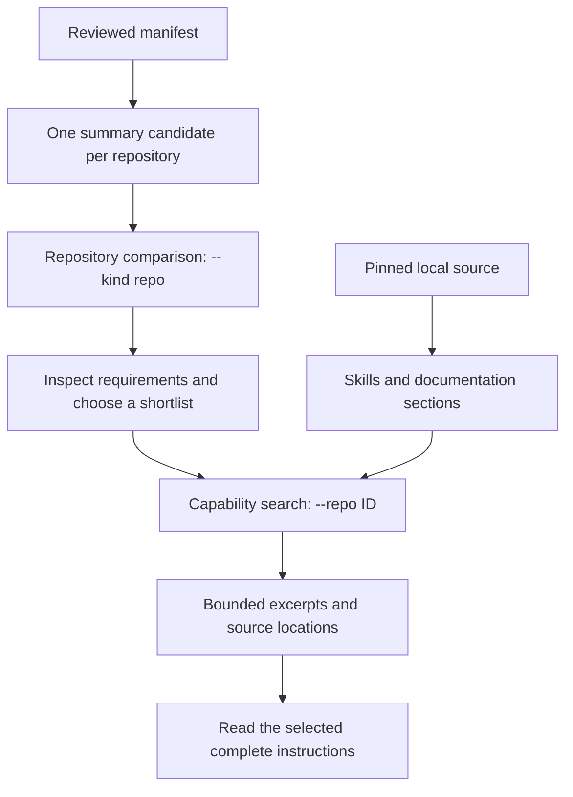

# Retrieval system

The toolkit searches reviewed repository summaries and locally available source documentation. Its job is to return useful candidates with paths and excerpts. It does not automatically identify the best system or establish that an upstream tool is ready to run.

## Compare repositories, then retrieve capabilities



A repository query gives each registered system a comparison candidate. An unrestricted capability query can correctly return several matches from one large bundle; it is not a balanced comparison of systems. Repeated chunks of the same capability are deduplicated so a long manual cannot consume all result slots.

## Corpus and indexing

[`corpus.py`](../../corpus.py) assembles repository summaries, registered production `SKILL.md` files, and selected documentation. It preserves source paths and line ranges. Missing repositories contribute catalog metadata but cannot contribute their source files.

Documentation is divided into sections and passages with a target size of **1,800 characters**, with up to **150 characters of overlap**. This is a character budget, independent of model tokenization. Registered skill paths distinguish usable skills from fixtures, provider duplicates, and internal maintainer instructions where the catalog review identified them.

[`hybrid.py`](../../hybrid.py) stores the corpus in SQLite. Index rebuilding is separate from external application setup. Unchanged passage embeddings are reused from a local content-hash cache keyed by the embedding configuration; a changed model fingerprint requires compatible vectors.

## Lexical retrieval

SQLite FTS5 uses the `porter unicode61` tokenizer and BM25 ranking. Queries are lowercased, common stop words and one-character terms are removed, and at most **32 terms** become individually quoted terms joined by `OR`. This favors documents containing useful task words without interpreting the user's text as raw FTS query syntax.

Use `--lexical` on search commands for lexical-only retrieval. This path needs no embedding dependencies or checkpoint.

## Local semantic retrieval

[`embeddings.py`](../../embeddings.py) uses `sentence-transformers/all-MiniLM-L6-v2` through FastEmbed and ONNX Runtime on CPU, producing normalized **384-dimensional float32 vectors**. The ONNX repository is [Qdrant/all-MiniLM-L6-v2-onnx](https://huggingface.co/Qdrant/all-MiniLM-L6-v2-onnx/tree/d13954661f83248295ba75c1ed411eef3b7b936e), pinned to revision `d13954661f83248295ba75c1ed411eef3b7b936e`. Model files are checked against recorded SHA-256 hashes before inference.

Long text is encoded through overlapping windows of **220 tokens**, with **32-token overlap**. Window vectors are normalized, mean-pooled, and normalized again, preserving coverage beyond a single model window. Queries use the same encoding without an instruction prefix. Semantic similarity uses the dot product of normalized vectors; candidates below the implementation's 0.25 similarity threshold are excluded from the dense ranking.

Only explicit setup downloads model files. Inference uses local files and requires no model API key, query API, or background embedding service. This does not make downstream catalog applications offline: their own providers and credentials are separate.

## Ranking and interpretation

Hybrid ranking uses reciprocal rank fusion:

```text
score = 1 / (20 + lexical_rank) + 1 / (20 + semantic_rank)
```

A missing channel contributes zero. Skill candidates receive a **1.1 multiplier**; exact repository identifier/name matches receive an additional preference. These are discovery heuristics, not calibrated probabilities. Raw cosine similarity and the fused ranking score measure different things.

If compatible vectors or the local model are unavailable, normal search reports a lexical fallback. `toolkit search-status` distinguishes hybrid coverage from fallback. `toolkit index --semantic` requires a complete semantic build and reports a failure when the runtime cannot supply one.

MiniLM is a compact general-purpose embedding model. Niche terminology, ambiguous queries, languages with weaker model coverage, or unfamiliar domain concepts can rank poorly. Refine the project outcome, use specific capability terms, apply `--repo`/`--kind` filters, and inspect source evidence before making a selection. There is no automatic best-tool guarantee.

## Context budget

The default command output limit is **8,000 characters, not tokens**. The index and full library stay on disk; returned excerpts are what enter agent context.

```bash
bin/toolkit --budget 4000 search "symbol references" --repo serena
bin/toolkit --budget 16000 read serena README.md
bin/toolkit read serena README.md --offset 8000
```

Use the continuation offset reported by `read` instead of guessing when possible. A clipped excerpt is not a complete skill. Read only the selected instructions and their necessary references, then reuse the project selection until the task changes.


## Project RAG and MCP

The [RAG service](../rag.md) builds project-level evidence bundles from this index, with capability diversity, verified citations, character budgets and explicit fallback status. Use `bin/toolkit recommend "project outcome"` or connect a local MCP host. The calling agent generates the answer; see the [agent demonstration](../rag-demo.md) and reproducible evaluation in the RAG guide.

[Back to the wiki](Home.md)
